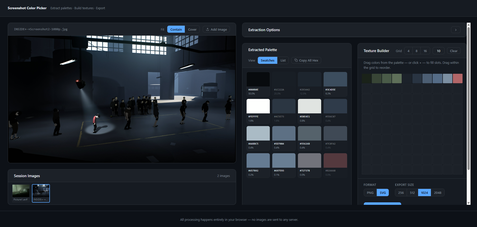
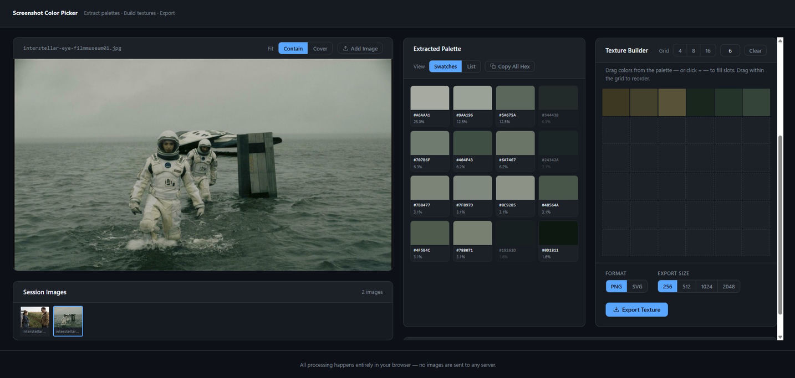

# Screenshot Color Picker

A fully client-side tool for extracting colour palettes from screenshots and building texture swatches — no server, no dependencies, no install.



---

## Features

- **Drop or browse** any image (PNG, JPG, GIF, WebP, BMP)
- **Median-Cut colour quantisation** — extract 8, 16, or 32 dominant colours
- **Sort palette** by frequency, hue, brightness, or saturation
- **Session history** — upload multiple images and switch between them; extracted palettes are remembered per image
- **Texture Builder** — drag colours from the palette into an N×N grid (type any size 1–64); drag within the grid to reorder; duplicate colours are blocked
- **Collapsible sections** — keep the interface tidy by folding panels you don't need
- **Export palette** as PNG or SVG at 256 / 512 / 1024 px in grid or strip layout
- **Export texture** as PNG or SVG at 256 / 512 / 1024 / 2048 px
- **Copy hex codes** individually (click a swatch) or all at once
- 100 % private — all processing happens in your browser; no image is ever sent to a server



---

## How to use

1. Open the app (see [Live demo](#live-demo) below)
2. Drop a screenshot onto the upload zone, or click **Browse a file**
3. Adjust the extraction options and click **Extract Colors**
4. Click **+** on a swatch (or drag it) to add it to the Texture Builder
5. Rearrange slots by dragging within the grid; click **×** on a slot or swatch to remove it
6. Export the palette or texture with your chosen format and size

To load a second image without losing the first, click **Add Image** — the Session Images panel lets you switch freely between all uploaded images.

---

## Live demo

The app is hosted via GitHub Pages:  
**[https://pausefish.github.io/Screenshot-Colorpicker](https://pausefish.github.io/Screenshot-Colorpicker)**

> To publish, merge branch `claude/screenshot-viewer-app-hUOfG` into `main` and enable GitHub Pages from the `main` branch root.

---

## Running locally

No build step needed. Just open `index.html` in any modern browser:

```bash
git clone https://github.com/PauseFish/Screenshot-Colorpicker.git
cd Screenshot-Colorpicker
open index.html        # macOS
# or double-click index.html in your file manager
```

---

## Tech stack

| Layer | Technology |
|-------|-----------|
| Markup | HTML5 |
| Styling | CSS3 (custom properties, flexbox, grid) |
| Logic | Vanilla JavaScript (ES2020, no frameworks) |
| Colour extraction | Median-Cut quantisation — implemented from scratch |
| Export | HTML5 Canvas API (PNG) · SVG string generation |
| File I/O | FileReader API · `canvas.toBlob()` · `URL.createObjectURL()` |

Zero npm packages. Zero build tools. Zero runtime dependencies.

---

## Project structure

```
Screenshot-Colorpicker/
├── index.html          # Single-page app shell
├── css/
│   └── style.css       # All styles (dark theme, responsive)
├── js/
│   └── app.js          # All logic (extraction, UI, export)
└── docs/
    ├── screenshot-overview.png
    └── screenshot-detail.png
```
